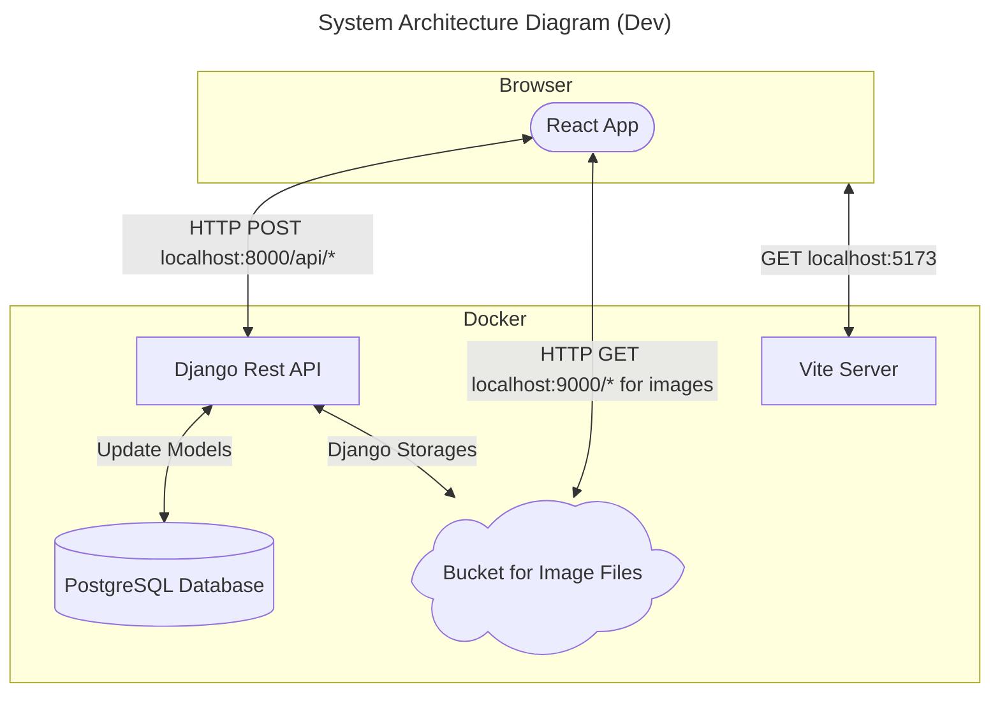
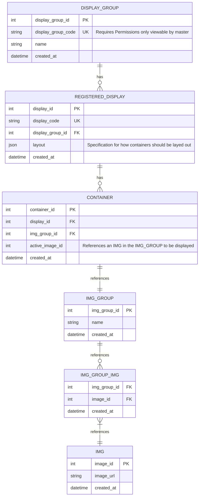

## Development Environment Architecture
Haichi is a browser-based remote display controller built with React, Django, MinIO / S3 Object Storage, and PostgreSQL,  containerized with Docker. The web platform was chosen for zero-installation access across devices. Target use cases include scoreboards, restaurant menus, image sharing, mini-games, and digital signage.

The WebApp allows for a "master" web-broswers to distribute images to "slave" web-browser. In `CREATE` mode the master can; upload images to master's `image-collection`, add new `display-group`, create `displays`, specify `layouts` within different `displays`, and specify `image-groups` for `containers` within `layouts`. In `CONTROL` mode the master can modify the `target-image` for different `containers` within the `displays` of a `display group`. 

Server side, a stateless implimentation was chosen to reduce complexity. State infromation is offloaded onto the database and the client handles state resoloution. The server ensures proper authentification and permissions for commands performed. In this implimentation the "slave" device continiously querries the server for state information. 





Ports
- `localhost:5173` for Vite
- `localhost:80` for ReactApp compiled
- `localhost:8000` for Django
- `localhost:9000` for MinIO.
- `localhost:9001` for MinIO console.
- `localhost:5432` for PostgreSQL

Django is needed to run the server. I installed django-environ and djangorestframework to have a REST API server than can be configured using environment variables. The django-storages allows an object-storage to be linked to django. To configure the object-storage with AWS / MinIO boto3 is used. The psycopg2-binary is a PostgreSQL adapter for Python so django can communicate to the database, it is a standard python driver.

Dependancies needed to get this working
```bash
pip install django django-environ psycopg2-binary django-storages boto3 djangorestframework
```

Build
```
docker compose up --build
```

## Rough Notes
Questions
- How will clients get the react instance? Can I instruct the server to serve it?
- Pagination in react?

Think about
- Environment variable for react server location
- Environment variable for django server location
- Look at setting up a `.env.local` file with `VITE_API_URL=http://localhost:8000` and add this to `CORS_ALLOWED_ORIGINS` in Django
- Claude recomendation, I will put the servers behind the same "reverse proxy" (Nginx is standard in DigitalOcean). Nginx listens on port 80/443 and routes `/api/*` to Django and everything else to react static build. Same droplet seperate processes.
- Can track ports using a `PORTS.md` or `docker-compose.yml` to list exposed ports and who owns it
- Continious testing config
- Add `rest_framework` to `INSTALLED_APPS` in settings after installing
 In production manage.py is for dev should be changed to an WSGI server

Sources
- Recomended to use ErDiagrams by claude learnt to make them using https://mermaid.js.org/syntax/entityRelationshipDiagram.html 
- Used MinIO docker compose as reference https://github.com/minio/minio/blob/master/docs/orchestration/docker-compose/docker-compose.yaml 
- For general volume referencing https://docs.docker.com/engine/storage/volumes/
- For dockerizing django https://www.docker.com/blog/how-to-dockerize-django-app/
- For postgreSQL https://hub.docker.com/_/postgres/
- Claude suggested using django-environ instead of python os.environ https://django-environ.readthedocs.io/en/latest/tips.html#handling-inline-comments-in-env-files 

Usage of AI
- Claude used often to critique design decisions and improve my vocabulary as a developer
- Initial architecture ideation done with Gemeni to discover S3 buckets, MinIO and django storages
- Used to determine ports needed for deploying application
- Advice on UML modeling and networking questions
- Advice on environment variable maintenance

Design decisions to consider
- Create an entire NodeJS server versus a single very simple react app that focuses on functionality?
- Is user authentication necessary or is a vault pwd, join code, join pwd all thats needed?
- How are join codes generated?

Pages
- Login
